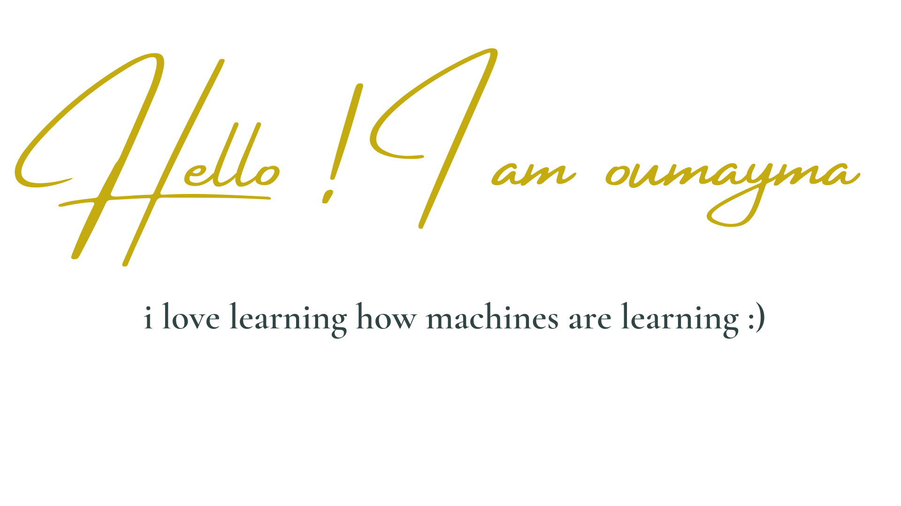

### Hi there 👋

 

[I'm a moroccan passionate girl about machine learning and analytics](http://touji2j.me/) ✨

**About me**

- 💼 Last year Engineering Student at [ENSIAS School](http://ensias.um5.ac.ma/)( National School of Computer Science and System Analysis), Branch : Data Analytics & Business Intelligence

- ⚡ I have a curious mind about discovering how things in the world are made

- ❤️ I love exploring the world of data to get useful and funny insights

- 💬 Ask me about anything [here](https://www.linkedin.com/in/oumaymatouji/)

- 🌱 I'm currently seeking for a 4 months graduation Internship in  BI / Data Analytics starting from February 2022.

- ⚡ Fun fact: My last name [Touji ~冬至~](https://guidable.co/culture/espanol-touji-%E5%86%AC%E8%87%B3/) comes from a japanese culture which means winter solstice in the 22nd of December.

**Languages and Tools:** 

<code></code>
<code></code>
<code></code>
<code></code>
<code></code>
<code></code>
<code></code>
<code></code>
<code></code>
<code></code>
<code></code>
<code></code>
<code></code>
<code></code>
<code></code>
<code></code>

<!--
**touji2j/touji2j** is a ✨ _special_ ✨ repository because its `README.md` (this file) appears on your GitHub profile.

Here are some ideas to get you started:

- 🔭 I’m currently working on ...
- 🌱 I’m currently learning ...
- 👯 I’m looking to collaborate on ...
- 🤔 I’m looking for help with ...
- 💬 Ask me about ...
- 📫 How to reach me: ...
- 😄 Pronouns: ...
- ⚡ Fun fact: ...
-->

 
